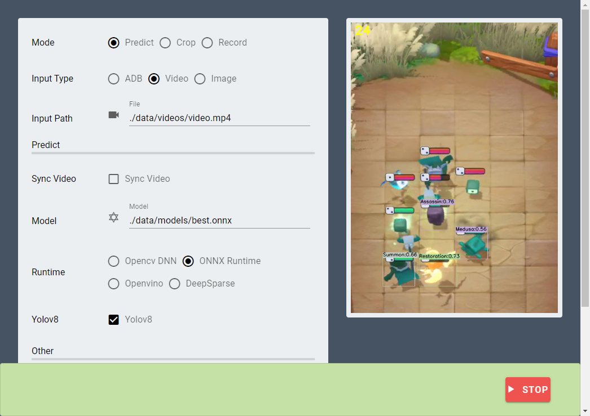

# Predict Tool

A tool to help users to test yolo models in Random Dice Roll Roll. You can use this tool to collect images and test models.  



## Features

- Predict models, crop grids and record videos in a tool.
- Multiple Input Types.
  - ADB: use adb to connect Android devices or emulators. (Recommended)
  - Video: any recording or video.
  - Image: any image.
- Multiple runtimes
  - Opencv DNN
  - ONNX Runtime
  - Openvino
  - DeepSparse (Only on Linux)
- Support Yolov5 & Yolov8
- Support CLI / GUI / Web interface

## Install

1. You need to create a virtual environment first and enter it.
    ```bash
    python -m venv env
    source env/bin/activate
    ```

2. We use `poetry` to manage the packages.
    ```bash
    python -m pip -U pip
    pip install poetry
    ```

3. Install all dependencies
    ```bash
    poetry install
    ```

## Run

1. Enter the virtual environment.
    ```bash
    source env/bin/activate
    ```

2. Run python
    ```bash
    python main.py
    ```
